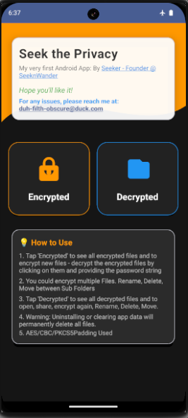
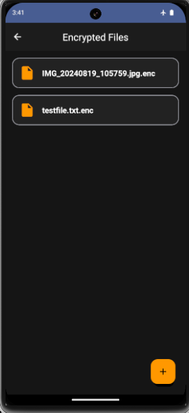
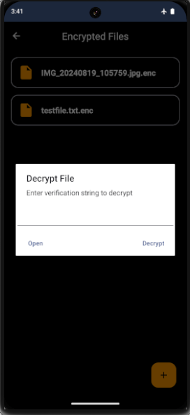
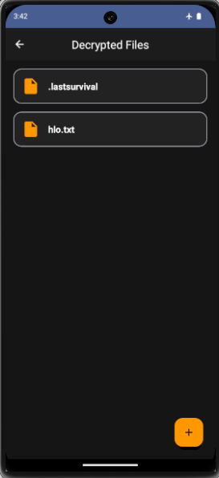
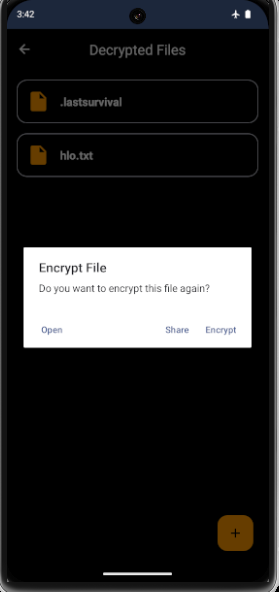
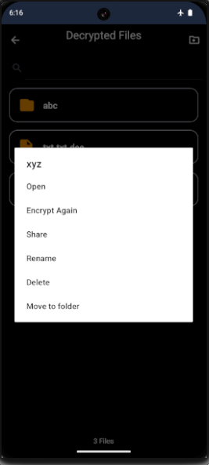

# SeekPrivacy: Protect Data From Apps with Storage Access Permission

## ⬇️ Download & Installation

[**Download SeekPrivacy v1.5 APK from Github**](https://github.com/duckniii/SeekPrivacy/releases/latest/download/seekprivacy-app-release.apk)

[**OR Download SeekPrivacy from AndroidFreeWare**](https://www.androidfreeware.net/download-seekprivacy-apk.html)

[**OR Download SeekPrivacy From OpenApk**](https://www.openapk.net/seekprivacy/com.seeker.seekprivacy/)

[**OR on Fdroid using Izzysoft Repo**](https://apt.izzysoft.de/packages/com.seeker.seekprivacy)

---
## Protection Without Friction
### Protect private files from apps with "All Files Access" - no trade-offs needed.

Apps constantly request storage access ; from basic media folders to full device control "All files access" permission, granting them unrestricted visibility into your device's storage. This creates a painful **trade-off** between **functionality** and **privacy**.

---

### SeekPrivacy eliminates that trade-off.

    Unlike a traditional vault, SeekPrivacy doesn't create a segregated safe-space; it actively **cloaks and encrypts** the files you designate as private. Even if a malicious app has full access to your storage, your protected files remain completely invisible and inaccessible to them.

    You maintain the **ease** of using your essential apps while enjoying complete **security** over your private data. Access your files normally, stay protected silently.

---

### What's SeekPrivacy Does:

* **Total App Blindness:** Any app, no matter what level of storage access it has will be unable to detect, read, or access your protected files.
* **Seamless Access for You:** You, the owner, can still open, view, and share these files **normally**.
* **Deep Security:** Because your files are encrypted, they are also protected from anyone gaining direct, physical access to your device's storage.

### What's New in V2.0

* **Removed freeze issue in loading bar while encryption** 
* **create sub folders for categorization** 
* **rename files**
* **count files**
* **search the files**
* **delete the file permanently**
* **Move files through sub folders**
* **More Operations on Files**

### Screenshots

## Logo and Branding

The Seek Privacy logo is property of SeeknWander. You may not use, copy, modify, or redistribute the logo without express permission from [SeeknWander](https://seeknwander.com). All Rights Reserved.
