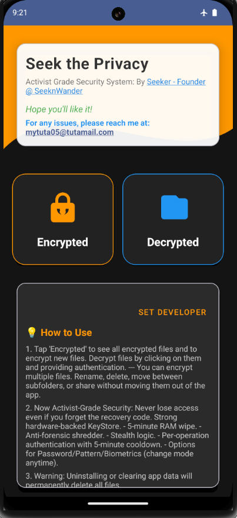
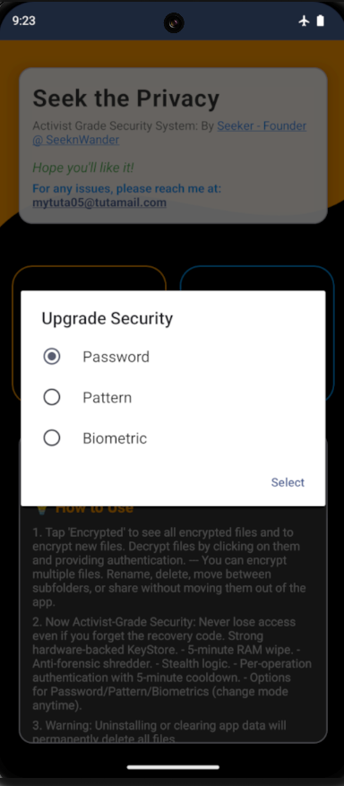
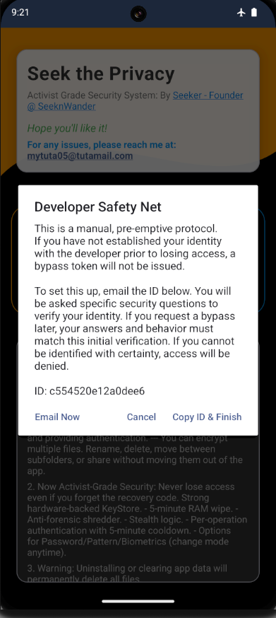
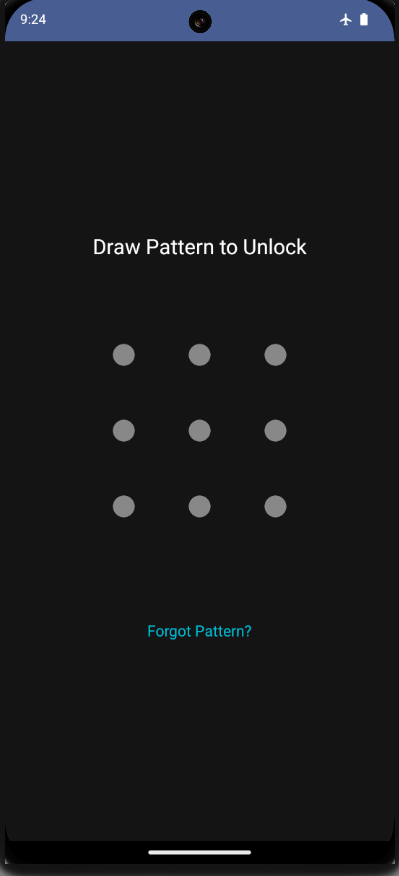

# SeekPrivacy: Activist-Grade Isolation Against "File Access" Surveillance

[](https://github.com/duckniii/SeekPrivacy/LICENSE)
[](https://github.com/duckniii/SeekPrivacy/releases/latest)
[](https://kotlinlang.org/)
[](#-architectural-integrity)
[](#-cryptographic-implementation)
[](#-forensic-countermeasures)

## ⬇️ Download & Installation


| Source | Status |
|--------|--------|
| **Github Releases** | [](https://github.com/duckniii/SeekPrivacy/releases/download/v3.0.1/seekprivacy-v3.0.1-release.apk) |
| **IzzyOnDroid** | [](https://apt.izzysoft.de/packages/com.seeker.seekprivacy) |
| **Android Freeware** | [](https://www.androidfreeware.net/download-seekprivacy-apk.html) |
| **OpenAPK** | [](https://www.openapk.net/seekprivacy/com.seeker.seekprivacy/) |
| **Appteka** | [](https://appteka.store/app/a54r258544) |


## 🛡️ The "No-Trade-Off" Revolution
Standard vaults create a clunky "island." **SeekPrivacy** creates a shield. Apps like social media and photo editors demand "All Files Access"—if you refuse, they break. If you accept, they spy.  This creates a painful **trade-off** between **functionality** and **privacy**.

**SeekPrivacy eliminates this blackmail.** We cloak your private data so that even if a malicious app has full device control, it sees **nothing**.

## ✊ The Activist Grade: "Trauma-Resilient" Defense
In high-risk environments, the greatest threat isn't just a remote hacker—it's **Physiological Stress**. When a device is seized or a user is detained, acute trauma causes cognitive blockages. In traditional FOSS vaults, forgetting your pattern means your evidence, your contacts, and your protection are effectively dead.

### Secure Dev Last Resort
SeekPrivacy is built for the human element. Our **Secure Dev Last Resort** is a world-first recovery bridge. By anchoring recovery to the non-exportable `ANDROID_ID` within the device’s physical **Trusted Execution Environment (TEE)** chip, we provide a secure "Extraction Point" for your data.

We eliminate the catastrophic tension of permanent lockouts. This system ensures that even if your memory falters under interrogation or duress, your life's work remains accessible through a verified, hardware-bound recovery path.

---

**🛡️ HARDENED | 🚫 OFFLINE | ✊ ACTIVIST-GRADE**

---

### 🛠️ Professional Management Suite (V2.0+)
We’ve integrated a full-featured management layer directly into the encrypted state. No more "decrypt-to-organize."
* **Nested Sub-Folders:** Total categorization within the vault.
* **Instant search:** Find any encrypted file across internal/external mirrors in milliseconds.
* **Hot-Rename & Move:** Modify file names and locations without breaking encryption.
* **Zero-Freeze Engine:** Completely rebuilt I/O logic. Heavy encryption (1GB+) now runs in the background without freezing the UI.
* **Live Count:** Real-time visibility into your vault’s volume.

### Activist-Grade Security Features
* **Hardware-Backed KeyStore:** Uses RSA-2048/AES-256 GCM. The keys stay in the hardware, not the software.
* **5-Minute RAM Wipe:** Sensitive key material is nullified automatically on idle to prevent memory-dump attacks.
* **Anti-Forensic Shredder:** Deletion doesn't just "unlink" files. SeekPrivacy overwrites file headers and the first 1MB with cryptographic random noise (SecureRandom). This creates high-entropy data residue that camouflages deleted files, defeating forensic recovery tools (like Cellebrite) that look for standard "zero-filled" wiped blocks.
* **Stealth Logic:** Screen-recording, screenshots, and "Recent Apps" snapshots are hardware-blocked (`FLAG_SECURE`).
* **Developer Bypass UI Zero-Tension Recovery:** A world-first recovery system using a hardware-anchored `ANDROID_ID` for secure, encrypted bypass token requests. Never fear losing your data due to a forgotten password. Our Secure Dev Last Resort provides a world-first recovery bridge, giving you the peace of mind that your life's work is never permanently locked away.
* **🚫 No Internet, No Leaks:** SeekPrivacy requests zero network permissions—total offline isolation means your data never leaves your device.


## Security Protocol
- **Cipher:** AES-256-GCM (Authenticated Encryption)
- **Key Management:** RSA-2048 (Hardware-Backed Android KeyStore)
- **Anti-Mirroring:** Hardware-level `FLAG_SECURE` blocks screenshots and screen recording.


## Activist Threat Model & Defense Scenarios

SeekPrivacy is engineered for high-risk environments (journalism, activism, whistleblowing) where device seizure or forced surveillance is a primary threat.

| Scenario | Attack Vector | SeekPrivacy Shield |
| :--- | :--- | :--- |
| **Physical Seizure** | An adversary gains physical access to your device. | **Anti-Forensic Shredding:** Deletion triggers a `RandomAccessFile` wipe of the first 1MB (headers + data), defeating tools like Cellebrite that "undelete" file signatures. |
| **Forced Handover** | You are forced to unlock your phone under duress. | **RAM-Zeroing Watchdog:** Inactivity or backgrounding the app triggers an immediate `SecretKey` nullification. Even if the phone is unlocked, the vault remains a "Black Box" until your specific pattern/pass is re-entered. |
| **All-Files Malware** | A "required" government or social app scans your storage for documents. | **Cryptographic Cloaking:** Files are encrypted with `AES-256-GCM` and metadata is stripped. To a scanning app, your private files appear as corrupted system blobs or are completely invisible to the OS index. |
| **Screen Surveillance** | Spyware or "Safety" apps record your screen to steal passwords/file lists. | **Hardware Block (`FLAG_SECURE`):** The Android Window Manager is instructed to block all screen-scraping, screenshots, and remote mirroring at the hardware level. |
| **Forensic Memory Dump** | Attacker attempts to pull encryption keys from the device's RAM. | **Zero-Persistence Logic:** Sensitive `CharArrays` are explicitly filled with `0x00` after use. Keys are wrapped in the Hardware-Backed KeyStore (TEE) and are non-exportable. |
| **Lost Credentials** | High-stress environments and trauma cause you to forget your complex pattern or password. | **Secure Dev Last Resort:** Eliminates the catastrophic tension of permanent data loss. Without this, losing your password means your evidence or life's work is gone forever. This world-first recovery bridge uses your unique hardware `ANDROID_ID` to grant a secure, transparent bypass, ensuring you never lose access to your data when you need it most. |


## Building from Source

To build the APK on your local machine, follow these instructions.

### Prerequisites
* **JDK 17**: Ensure you have OpenJDK 17 installed and active.
* **Android SDK**: You need the Android SDK platforms and Build-Tools installed (available via Android Studio).
* **Gradle**: This project uses the included Gradle Wrapper (no separate installation required).

### Setup and Build

1. **Clone the repository:**
   
```bash
   git clone [https://github.com/duckniii/SeekPrivacy.git](https://github.com/duckniii/SeekPrivacy.git)
   cd SeekPrivacy
```

2. **Check Java Version:**
*Verify you are using the correct version by running:*

```bash
  java -version
```
*It should report version 17.*

3. **Run the Build:**
   Execute the following command in the project root:

   **On Linux or macOS:**
   ```bash
   ./gradlew assembleRelease
   ```
   **On Windows (Command Prompt or PowerShell):**
   ```bash
   gradlew.bat assembleRelease
   ```

---

### Screenshots









## Logo and Branding

The Seek Privacy logo is property of SeeknWander. You may not use, copy, modify, or redistribute the logo without express permission from [SeeknWander](https://seeknwander.com). All Rights Reserved.

---

#android #security #privacy #encryption #activism #cryptography #antiforensics #cybersecurity #infosec #dataprivacy #antisurveillance #encryptiontools #open-source
